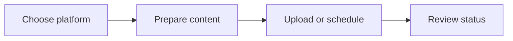

# SocialSync Publishing Dashboard

<p align="center">
  <strong>A multi-platform publishing dashboard prototype for YouTube, Facebook, Instagram, Pinterest, and WordPress.</strong>
</p>

<p align="center">
  
  
  
</p>

## Overview

SocialSync is a frontend dashboard for planning content operations across multiple publishing channels. It groups uploads, bulk workflows, schedules, writing assistance, settings, and analytics placeholders into a consistent workspace.

## The problem

Creators and small teams lose time switching between platform dashboards and repeating the same content preparation steps.

## The solution

This interface explores one operational home for content uploads, scheduling, bulk tasks, and channel-specific workflows.

## What it demonstrates

- Dashboard information architecture
- Reusable channel and upload components
- Responsive tab navigation
- Product design for multi-step publishing workflows

## Core capabilities

| Capability | Practical value |
|---|---|
| Multi-channel navigation | YouTube, Facebook, Instagram, Pinterest, and WordPress areas |
| Video workflows | Standard video and Shorts upload interfaces |
| Bulk upload | Batch-oriented content submission UI |
| Scheduling | Scheduled-post views organized by platform |
| Writing assistance | Ollama-oriented text editor component |
| Settings | Central location for integration configuration |

## Workflow



## Technology

- React
- TypeScript
- Vite
- Tailwind CSS
- Lucide icons

## Project status

**Frontend product prototype**

The repository primarily demonstrates the interface. Provider authentication and production publishing APIs should be completed and documented before presenting it as a live publishing service.

## Run locally

```bash
git clone https://github.com/nasratulnayem/socialsync-publishing-dashboard.git
cd socialsync-publishing-dashboard
npm install
npm run dev
```

## Usage

Sign in through the prototype interface, select a platform, then explore upload, scheduling, bulk, and settings flows.

## Engineering notes

- Configuration and credentials should be supplied through environment variables or local files excluded from Git.
- Generated output and runtime data should not be committed.
- Claims in this README describe the capabilities visible in this repository.
- Before production deployment, review authentication, rate limits, error handling, logging, and provider terms.

## Roadmap

- [ ] Implement OAuth for each supported platform
- [ ] Add a secure backend and encrypted token storage
- [ ] Create a real cross-platform publishing queue
- [ ] Add integration and end-to-end tests

## About the developer

Built by **Nasratul Nayem**, a WordPress, WooCommerce, and automation developer based in Dhaka, Bangladesh.

I build practical systems that remove repetitive work: WordPress plugins, WooCommerce integrations, browser extensions, Python automation, AI-assisted content pipelines, and internal business tools.

- Portfolio: [nayem.dev](https://nayem.dev)
- GitHub: [@nasratulnayem](https://github.com/nasratulnayem)
- LinkedIn: [Nasratul Nayem](https://www.linkedin.com/in/nasratulnayem)

## License

Review the repository license before reuse. Third-party services and APIs remain subject to their own terms.
